# A Guide to Tower Pro SG90 servo (normal and fail)

## Motivation

Information is scattered trough many sites. In special about unexpected behaviour like motor/driver heating and arm locking.

## Instructions and Results

SG90 Datasheet is in http://www.ee.ic.ac.uk/pcheung/teaching/DE1_EE/stores/sg90_datasheet.pdf (PDF format), https://docs.sunfounder.com/projects/umsk/en/latest/01_components_basic/33-component_servo.html (HTML format).

### Normal use

Connect servo BROWN wire is GND, RED wire is 5v (not 3V3), ORANGE wire is PWM CONTROL (e.g. ESP32 pin 25 https://github.com/JadnoABS/digitalLocker/tree/main)  

Servo PWM frequency is 50Hz. High logic level pulse width controls axis rotation (approximate) pulse width - angle correspondence are

| pulse width | angle (PDF reference) | angle (HTML reference) |
| --- | --- | --- |
| 1ms | -90 | --- |
| 1,5ms | zero (reference) | --- |
| 2ms | 90 | --- |
| 0,5ms | --- | 0 (reference) |
| 1,5ms | --- | 90 |
| 2,5ms | --- | 180 |

#### About angle control 

PWM signals generated with ESP32 range from 0 to 100% duty cycle in steps from 0 to 1023. The range usable for SG90 is 23-126 (insert reference here). Calculations shown later.  

#### About electric power

There is a small DC motor inside the plastic body. DC motors may use electric power enough to shut off a computer USB port (its an overload protection). The microcontroller (e.g. Arduino, ESP32,...) will also be shut off, resulting in communication loss. It can be noticed clearly with Micropython.

Servo DC motor is driven by an electronic circuit that implements a transfer function from PWM signals to motor DC voltage (can be considered a translation from PWM to DC voltage). Small angle displacement requires small difference in DC voltage (usually corresponds to small power consumption increase). Large angle displacement requires large difference in DC voltage (usually corresponds to large power consumption increase). 

SG90 axis is connected to its motor axis through some plastic gears (a reduction box).

A correctly powered and operated SG90 draws power to actively mantain its axis in an angle. If the axis is loaded (twisted with an arm or weight), the load is balanced by an increase in power draw. This can cause a computer USB port to shut off.

SG90 may shake continuously. This seems to be about the precision of the electronic driver or the kind of control circuit (may be a PID(?)). It never reaches the target angle *exactly*. The axis pass the target a little on both sides (clockwise,counter-clockwise) and the control circuit "tries to correct it". Consequently the servo shakes.

#### Over-rotation protection

One gear has a tooth to its side. It is and end-of-course lock to avoid damage to the electronic angle sensor (a trimpot). 

### Abnormal conditions

SG90 axis can get stuck. Gears can have burrs. So depending on the axis angle, a random burr may lock the gears. This condition makes DC motor and electronic driver heat continuously (because the axis never reaches the targeted angle). This can also cause a computer USB port to shut off.

#### Recovery

The safest way is to disassemble the servo (unscrew the four screws from the back of the servo) and inspect for burrs, scrobs, cracked gears, ...)

The fast way is to disconnect the servo and (fimly but gently) rotate the axis (in normal conditions it should roll until reach end-of-course). If the axis is stucked there is a chance it unsticks (**warning**: there is also a chance some gear breaks, choice is yours)

## For the curious one

### screws

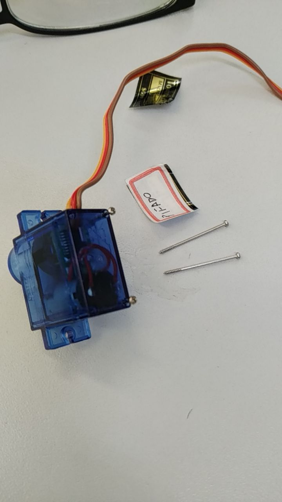
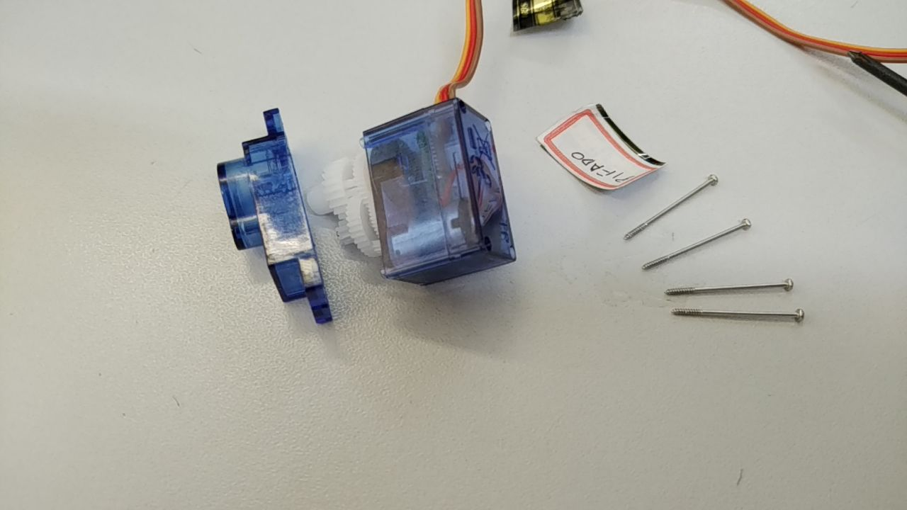

### Cracked motor nut

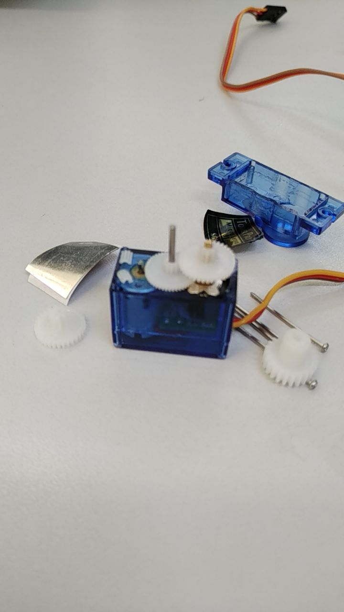

### Gears removed

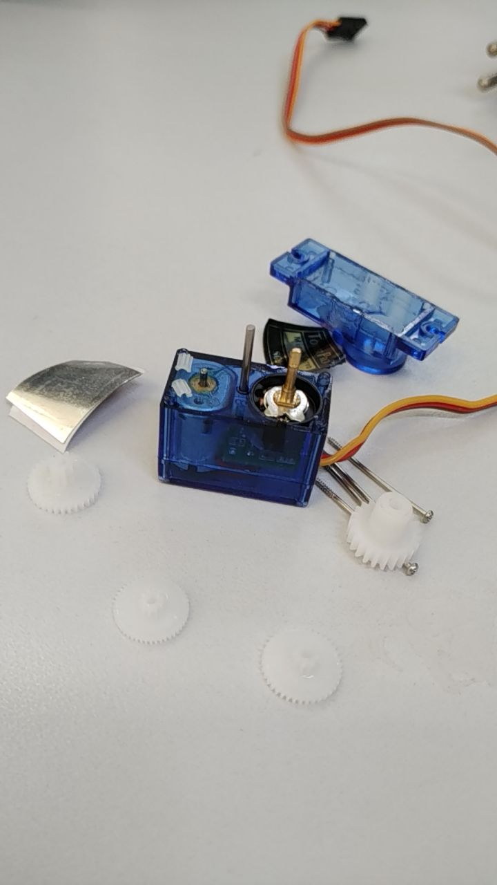

### screws removed

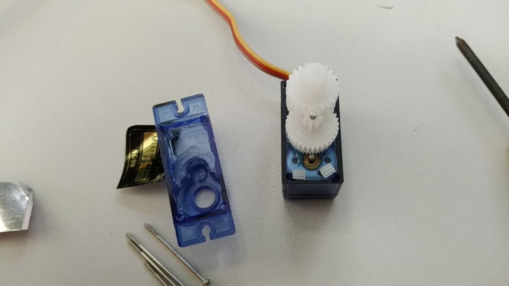

### Control circuit and DC motor (through the case)

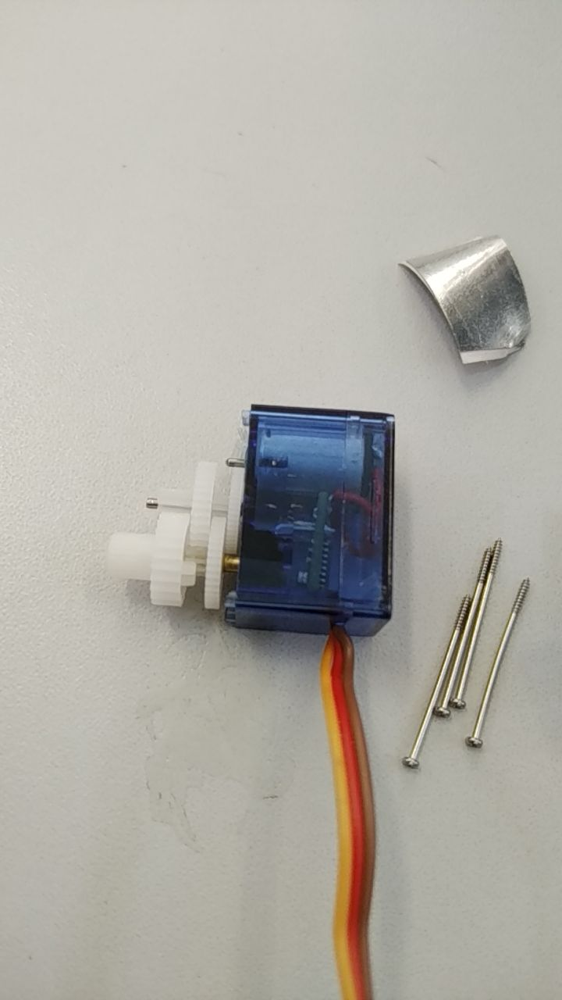

### Cracked motor nut

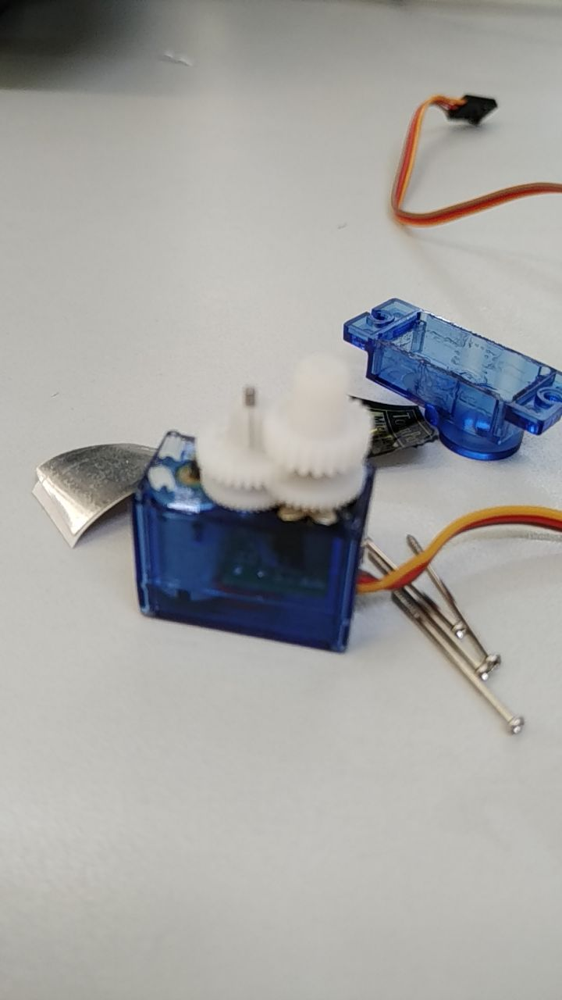
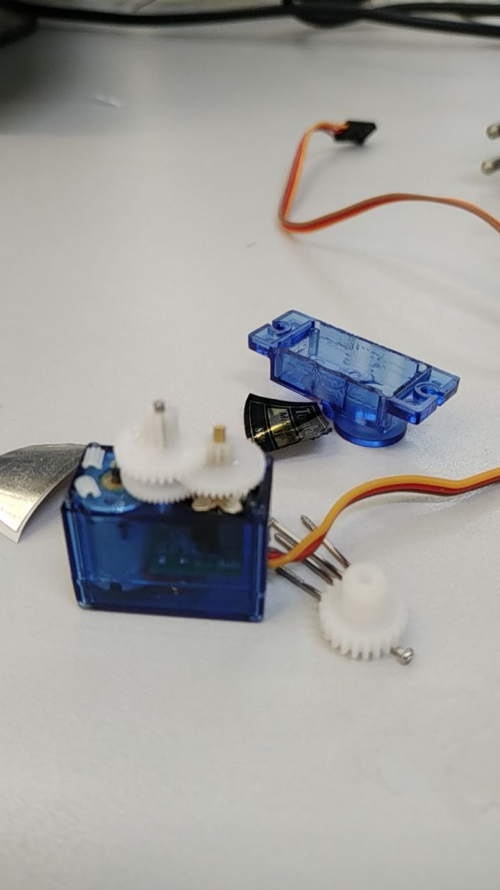

### Trimpot (in the servo case, to the right)

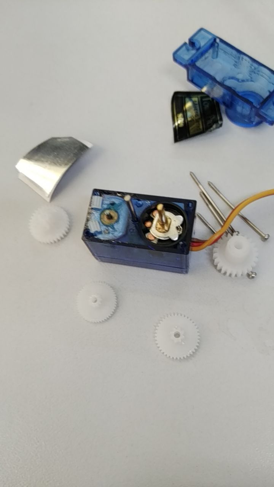

### Drip some hot melt glue to see the axis rolling

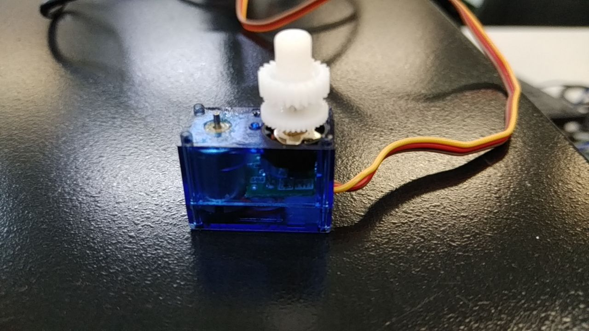
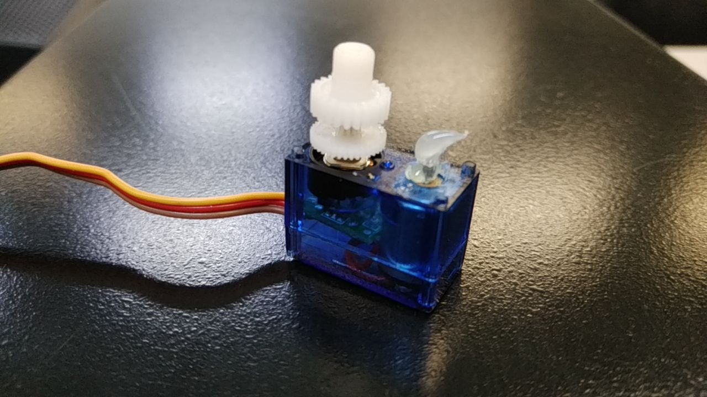

### Axis rolling videos

(to be added)

   
## References

Servo gets hot at startup: https://forum.arduino.cc/t/servo-gets-hot-at-start-up/282376/23

Servo overheat and jam: https://forum.arduino.cc/t/servos-sg90-overheat-and-jam-really-fast/559423/4

Modify (disassemble) servo: https://www.instructables.com/How-to-Modify-a-Micro-Servo-Motor-SG90-for-Continu/

Other explanation: https://jawhersebai.com/tutorials/how-to-use-the-sg90-servo-motor/

